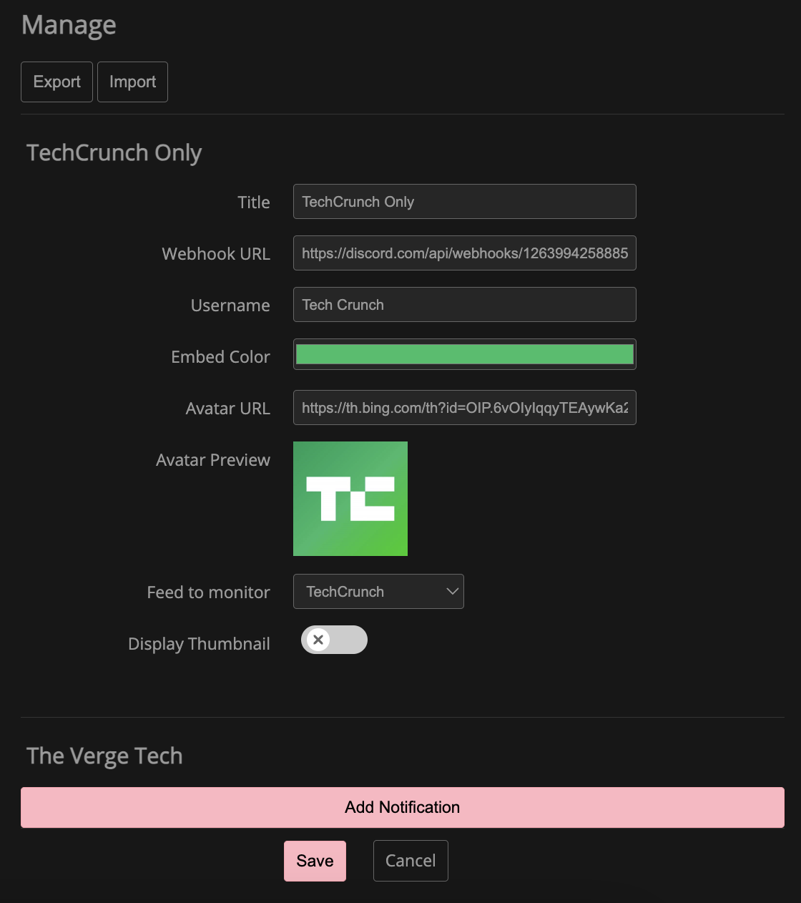

# FreshRSS - Discord Notifications
Send notifications to a discord channel using webhooks when a new entry gets added to the feed.

## Installation:
To install this extension you must go to the `extensions` folder of FreshRSS and download/clone this repository inside.

Then, on your FreshRSS instance go to `Settings>Extensions`, under ***User Extensions*** configure **Discord Notifications** and enable it.

## Configuration:
* Webhook URL*: The Url of the discord webhook. *`required`*
* Username: Username to be shown in the chat. *`optional`*
* Embed Color: Color of the embed to be shown. *`required`*
* Avatar URL: Url of the avatar to be shown on discord. *`optional`*

**To get the Webhook URL go to your discord server and on the channel you want the webhook click `Edit Channel`, then go to `Integrations` and on `Webhooks` create a new one and copy the URL*

## Features:
* Send a Discord message when a new entry is added to the feed.
* Easy configuration.
* Update notifier (available inside extension config).
* Import/Export current items.
* Custom webhook JSON data. - TODO
* Preview of message to be sent to Discord. - TODO
* Feed specific Discord notifier.

## Showcase

